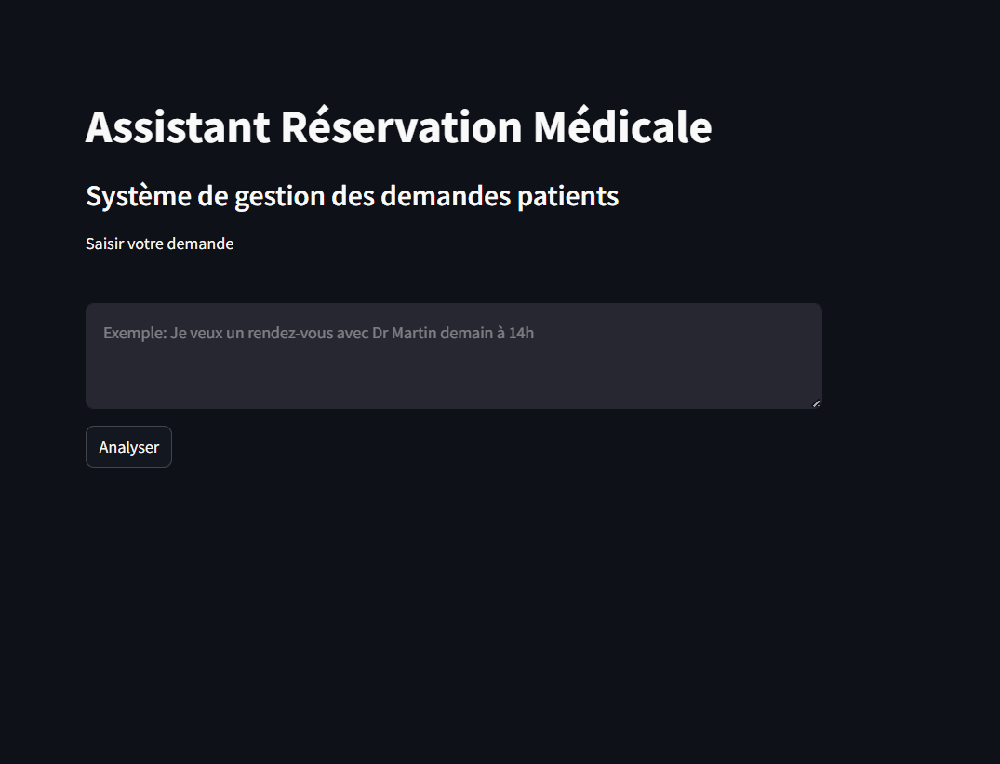

# Medical Appointment Assistant



## Description

This project implements an AI-powered medical appointment management system. The assistant analyzes patient requests in natural language and classifies them into three categories: **RESERVATION** (medical appointment booking), **MESSAGE** (messages for doctors), or **HORS_SUJET** (off-topic). The system extracts relevant information such as time, date, and doctor name when applicable.

The project demonstrates three different AI approaches for text classification and information extraction in the medical domain:

## Methods Implemented

### 1. Fine-Tuned Phi-3 Model (LoRA)
**File**: `app_finetuned_streamlit_final.py`

This method fine-tunes Microsoft's Phi-3 model using LoRA (Low-Rank Adaptation) for parameter-efficient learning. The fine-tuned model directly generates structured JSON responses from medical requests, eliminating the need for complex prompting or external APIs.

Key features:
- Uses PEFT (Parameter-Efficient Fine-Tuning) with LoRA
- Trained on medical appointment data
- Generates JSON responses directly
- GPU acceleration support

### 2. Local Phi-3 with Few-Shot Learning (Ollama)
**File**: `app_ollama.py`

This approach uses the Phi-3 model locally via Ollama with few-shot prompting. The system includes 10 curated examples in the prompt to guide the model in correctly classifying and extracting information from medical requests.

Key features:
- Fully local deployment (no API calls)
- Few-shot learning with balanced examples
- Uses Microsoft's Phi-3-mini-4k-instruct model
- Real-time inference

### 3. Google Gemini 2.0 Flash with LangChain
**File**: `app.py`

This method leverages Google's Gemini 2.0 Flash model through LangChain's LLM chains. The prompt includes clear rules and examples for classification, utilizing the model's large knowledge base for zero-shot learning.

Key features:
- Cloud-based API approach
- LangChain integration for modular design
- Zero-shot learning capabilities
- High-speed inference with Gemini 2.0 Flash

## Installation

1. Clone the repository:
```bash
git clone https://github.com/MontassarbellahAbdallah/hydrogen.git
cd hydrogen
```

2. Install dependencies:
```bash
pip install -r requirements.txt
```

3. For Ollama setup:
```bash
ollama pull phi3:mini
```

4. For fine-tuned model: Ensure the `phi3_medical_finetuned` directory is present.

5. Set up Google API key in `.env` file for the Gemini method:
```
GOOGLE_API_KEY=your_api_key_here
```

## Usage

### Running the Fine-Tuned Model App
```bash
streamlit run app_finetuned_streamlit_final.py
```

### Running the Ollama App
```bash
streamlit run app_ollama.py
```

### Running the Gemini App
```bash
streamlit run app.py
```

## Project Structure

- `app.py` - Google Gemini implementation
- `app_ollama.py` - Local Phi-3 implementation
- `app_finetuned_streamlit_final.py` - Fine-tuned Phi-3 implementation
- `finetune_phi3.py` - Fine-tuning script
- `evaluate_model.py` - Model evaluation
- `phi3_medical_finetuned/` - Fine-tuned model directory
- `requirements.txt` - Dependencies
- `data.json` - Training data
- `test_data.json` - Test data

## Requirements

- Python 3.8+
- GPU recommended for fine-tuning
- Google API key for Gemini method
- Ollama installed for local Phi-3
